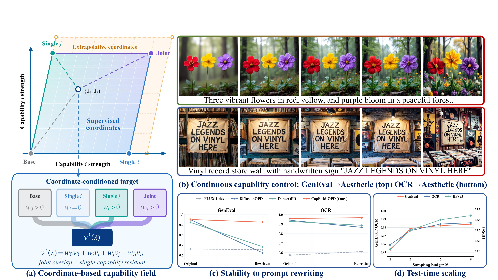

# CapField-OPD

**Learning Continuous Capability Fields via Joint-Anchored Multi-Teacher On-Policy Distillation for Flow Models**

[](https://arxiv.org/abs/2609.34658v2)
[](https://huggingface.co/Yang18/CapField-OPD)
[](LICENSE)



## Abstract

&gt; Reward-specialized post-training produces strong experts for flow-based generative models, while multi-teacher on-policy distillation (OPD) consolidates their capabilities into a single student. Existing methods, however, route each prompt to a single teacher according to its semantic category, implicitly binding the desired capability to prompt content. This coupling makes capability invocation vulnerable to prompt perturbations and prevents users from explicitly adjusting the strength of the desired capability at inference time. In this work, we introduce CapField-OPD, an OPD framework that integrates multiple teachers into a continuous capability field through explicit capability coordinates. We use teacher models as anchors to construct this field, with the coordinates determining how their outputs are combined. Each capability configuration thus receives a unique supervision target, and capability control no longer depends on prompt semantics. Since the training anchors may not be optimal at inference time, we further profile the learned field on a small calibration set. The coordinate with the highest mean reward serves as the recommended default, while coordinates that are frequently optimal offer a promising candidate set for test-time scaling. Extensive experiments on compositional generation, text rendering, and visual aesthetics demonstrate that CapField-OPD consolidates multiple specialized teachers into a single student while preserving or surpassing their performance, reliably invokes the desired capabilities under semantics-preserving prompt variations, and supports continuous capability control and coordinate-based test-time scaling.

## Overview

**CapField-OPD** distills several task-specific diffusion teachers (each a frozen LoRA) into a **single student LoRA** whose behaviour is controlled by a **coordinate in a capability field**. Each capability axis is one skill (e.g. OCR, aesthetics); a coordinate is a weight vector over those axes, so at inference time you can dial any mixture, including pairs that were never trained as a dedicated model.

The recipe is simple and on-policy (no reward model, no RL):

```
1. rollout   the student denoises from noise, conditioned on a sampled coordinate
2. target    build the teacher velocity for that coordinate by mixing teachers
3. loss      mean-squared error between student and teacher velocity
4. update    optimize the student LoRA (and the coordinate conditioner)
```

Reward models are **not** used during training. Reward scoring is only a logging / evaluation signal and has no effect on the optimization, so it lives in a separate optional service (`reward_server.py`).

## Table of Contents

- [Method](#method)
- [Repository Layout](#repository-layout)
- [Installation](#installation)
- [Pretrained Weights](#pretrained-weights)
- [Data and Teachers](#data-and-teachers)
- [Training](#training)
- [Inference](#inference)
- [Optional Reward (Evaluation Only)](#optional-reward-evaluation-only)
- [Citation](#citation)
- [License](#license)

## Method

Let the capability field have `M` axes and let `omega` be a coordinate (a length-`M` weight vector). The student is the pretrained model plus a LoRA, conditioned on `omega` through a small MLP that is added to the model's global conditioning vector:

```
omega --Linear(M,256)--&gt; SiLU --&gt; Linear(256,d) --&gt; + global conditioning vector
```

Each teacher is a frozen LoRA with its own one-hot (single-axis) or two-hot (joint) coordinate. The teacher velocity for a coordinate is assembled by inclusion-exclusion over the registered teachers:

```
single axis j, strength a           : v = (1-a)·v_base + a·v_j
two axes i,j, strengths a,b, m=min  : v = (1-a-b+m)·v_base
                                        + (a-m)·v_i + (b-m)·v_j + m·v_ij
```

`v_base` is the raw pretrained model (zero LoRA). A coordinate used for the teacher target may have at most two active axes; the student itself accepts any coordinate at inference time.

## Repository Layout

```
CapField-OPD/
├── train.py            # training entry point
├── inference.py        # one prompt -&gt; many coordinates
├── modeling.py         # teacher registry, model loading, capability-field hook
├── distillation.py     # rollout, teacher target, OPD loss, checkpoint saving
├── dataset.py          # multi-source prompt dataset
├── ema.py              # EMA of trainable parameters
├── utils.py            # latent packing / position ids / logging
├── reward_server.py    # OPTIONAL evaluation-only reward HTTP service
├── hpsv3_reward.py     #   aesthetic (HPSv3) reward loader
├── geneval_reward.py   #   GenEval reward loader
├── geneval_assets/     #   GenEval object names
├── configs/            # example launch scripts (two templates + inference)
└── dataset/            # training prompts shipped with the repo
```

## Installation

The conda environment is named **`capfieldopd`**.

```bash
conda create -n capfieldopd python=3.10 -y
conda activate capfieldopd

# PyTorch (CUDA 12.8 build, matching the reference environment)
pip install torch==2.7.0 --index-url https://download.pytorch.org/whl/cu128

# Remaining training / inference dependencies
pip install -r requirements.txt
```

Key versions used in our experiments (the rest are pinned in `requirements.txt`):

| Package | Version |
| --- | --- |
| Python | 3.10 |
| PyTorch | 2.7.0 (+cu128) |
| diffusers | 0.36.0 |
| transformers | 4.45.2 |
| accelerate | 1.12.0 |
| peft | 0.18.1 |

Also pre-download a FLUX base model (e.g. `black-forest-labs/FLUX.1-dev`) and one LoRA per capability axis (the teachers).

## Pretrained Weights

The released CapField-OPD checkpoints are on the Hugging Face Hub:

**&lt;https://huggingface.co/Yang18/CapField-OPD&gt;**

```bash
pip install -U "huggingface_hub[cli]"
huggingface-cli download Yang18/CapField-OPD --local-dir ckpts/CapField-OPD
```

The repository is laid out as:

```
CapField-OPD/
├── student_ckpt/                    # the unified student (used for inference)
│   ├── adapter_config.json
│   ├── adapter_model.safetensors
│   └── task_conditioner.pt          # capability-coordinate conditioner
└── teachers_ckpt/                   # frozen teachers (used for training)
    ├── geneval_teacher/
    ├── ocr_teacher/
    ├── aesthetic_teacher/
    ├── geneval_aesthetic_teacher/
    └── ocr_aesthetic_teacher/
```

`inference.py` reads `student_ckpt/`; `configs/train_mopd.sh` reads `teachers_ckpt/`. Both can be pointed at the local download above or at the Hub repo directly, so a manual download is optional. (Checkpoints trained with this code use the same `task_conditioner.pt` name as the release; legacy checkpoints that call it `cap_field_conditioner.pt` are also accepted when loading.)

## Data and Teachers

* Every capability axis owns one prompt file, either a `.txt` (one prompt per line) or a `.jsonl` (each line a dict with a `prompt` field, e.g. GenEval). The prompt files used in our training are provided under `dataset/`.
* Each teacher is passed as `"LORA_PATH | v1 v2 ... vM"`, where `M` is the number of axes and the vector is the teacher's coordinate. Use `none` as the path for the raw base model. One single-axis teacher (`e_i`) is required per axis; joint teachers (`e_i + e_j`) are optional.
* Teachers are listed literally in the `EXPERTS=()` array of the launch script. The templates read them from `TEACHERS_DIR` (default `ckpts/CapField-OPD/teachers_ckpt`, i.e. the released `teachers_ckpt/`): put the teacher LoRAs there, or point `TEACHERS_DIR` / the individual paths at your own copies. `FLUX_PATH` and `TEACHERS_DIR` can also be overridden by environment variable.

For reference, `configs/train_mopd.sh` expects these five teachers under `TEACHERS_DIR` (axis 0/1/2 = geneval / ocr / aesthetics):

```
geneval_teacher             -&gt; 1 0 0   (geneval)
ocr_teacher                 -&gt; 0 1 0   (ocr)
aesthetic_teacher           -&gt; 0 0 1   (aesthetics)
geneval_aesthetic_teacher   -&gt; 1 0 1   (geneval x aesthetics)
ocr_aesthetic_teacher       -&gt; 0 1 1   (ocr x aesthetics)
```

`configs/train_sopd.sh` only needs `ocr_teacher`.

## Training

Two launch templates are provided:

```bash
# Single teacher (1 axis) - minimal sanity check.
bash configs/train_sopd.sh

# Multi teacher capability field (3 axes: geneval / ocr / aesthetics) - default.
bash configs/train_mopd.sh
```

Both scripts train directly on the local files under `dataset/`. Put the teacher LoRAs under `TEACHERS_DIR` (default `ckpts/CapField-OPD/teachers_ckpt`) or edit the paths in the `EXPERTS=()` array, set `FLUX_PATH` to your FLUX base model, then run the script.

Key options (see `train.py --help` for the full list):

| Flag | Meaning |
| --- | --- |
| `--experts` | teacher pool, each `"LORA_PATH\|v1 v2 ... vM"`. |
| `--source_prompt_txt_paths` | one prompt file per axis; order defines the axes. |
| `--source_cond_vectors` | per-axis loss coordinate pool, e.g. `"1 0; 0.7 0; 1 1"`. |
| `--rollout_cond_vectors` | per-axis rollout coordinate pool; omit to use each axis' own anchor. |
| `--rollout_cond_probs` | sampling probabilities for each rollout pool (`none` = uniform). |
| `--train_stepidx` | timesteps at which the distillation loss is applied. |
| `--loss_target` | `velocity`, `next_latent` or `pred_x0`. |
| `--gradient_checkpointing` | enabled by default; disable with `--no-gradient_checkpointing`. |
| `--ema` | additionally save EMA weights to `step_N_ema/`. |

Checkpoints are written flat:

```
runs/mopd/step_2000/
├── adapter_config.json
├── adapter_model.safetensors
└── task_conditioner.pt
```

## Inference

Give one prompt and any number of coordinates; images share a single initial noise so only the coordinate changes.

The released student can be used straight from the Hub (downloaded on the fly if not already cached):

```bash
export PROMPT='A photo of a red apple and a blue cup on a table'
export CKPT=Yang18/CapField-OPD
export CKPT_SUBFOLDER=student_ckpt
bash configs/inference.sh
```

or directly (coordinates are 3-axis `[geneval, ocr, aesthetics]`):

```bash
export PROMPT='A photo of a red apple and a blue cup on a table'

python inference.py \
    --ckpt Yang18/CapField-OPD --ckpt_subfolder student_ckpt \
    --prompt "${PROMPT}" \
    --coords "0.0 0.0 0.0" "1.0 0.0 0.0" "1.0 0.0 1.0"
```

With `lambda = (geneval, ocr, aesthetics)`, `(0,0,0)` recovers the base model, `(1,0,0)` / `(0,1,0)` / `(0,0,1)` the single-capability teachers, and `(1,0,1)` / `(0,1,1)` the joint teachers; intermediate (and beyond-range) values give continuous control and capability extrapolation.

`--base_model` defaults to `black-forest-labs/FLUX.1-dev` (a local path or any repo id is also accepted). For a locally downloaded checkpoint, pass the folder directly and omit `--ckpt_subfolder`, e.g. `--ckpt ckpts/CapField-OPD/student_ckpt`.

## Optional Reward (Evaluation Only)

Training never uses a reward. If you want to score generated images, start the optional reward service (one process per GPU) in a separate environment:

```bash
python reward_server.py --reward_name paddleocr hpsv3 --port 15000 --gpu 0 \
    --paddleocr_model_dir /path/to/paddleocr/whl \
    --hpsv3_config /path/to/HPSv3_7B.yaml \
    --hpsv3_ckpt /path/to/HPSv3.safetensors
```

Supported rewards: `hpsv3`, `clip`, `pickscore`, `paddleocr`, `geneval`. Then POST images (base64) to `http://127.0.0.1:&lt;port&gt;/compute_reward`. Check `/health` until it returns `ok` before sending requests. The extra packages and model checkpoints needed by each reward are listed in `requirements.txt`.

## Citation

If you find this project useful, please cite:

```bibtex
@article{ling2026capfield,
  title={CapField-OPD: Learning Continuous Capability Fields via Joint-Anchored Multi-Teacher On-Policy Distillation for Flow Models},
  author={Ling, Pengyang and Bu, Jiazi and Zhou, Yujie and Wang, Yibin and Lai, Zeqiang and Ma, Xiaoxiao and Jin, Yi and Chen, Huaian and Zang, Yuhang},
  journal={arXiv preprint arXiv:2609.34658},
  year={2026}
}
```

## Acknowledgements

We thank the [Flow-GRPO](https://github.com/yifan123/flow_grpo), [DiffusionOPD](https://github.com/ali-vilab/DiffusionOPD), and [FLUX.1-dev](https://huggingface.co/black-forest-labs/FLUX.1-dev) projects.

## License

Apache-2.0.
